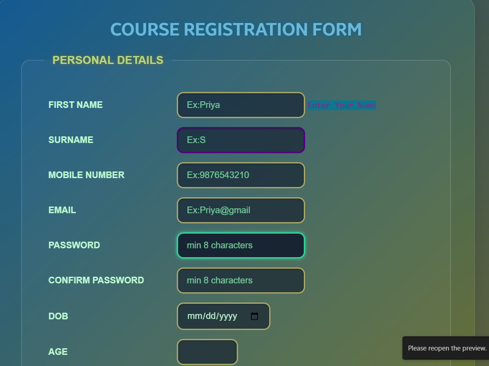

# 🎓 Course Registration Form

This is a beautifully styled and responsive **Course Registration Form** built using HTML and CSS. It collects personal and course-related details from users and includes input validation, custom styles, hover effects, and more.

---

## 📌 Features

- ✅ Personal Information Fields (Name, Email, Mobile, DOB, Age, etc.)
- 🔒 Password and Confirm Password with validation
- 🌍 Country selection and gender radio buttons
- 🖼️ File upload field (e.g., picture/resume)
- 🎯 Course selection with delivery mode (online/offline)
- 🎚️ Coding knowledge level slider
- 📝 Comments text area
- 💡 Live input feedback (placeholder hints & field focus)
- 🎨 Modern glassmorphism UI with gradients and shadows

---

## 🚀 Technologies Used

- **HTML5** – Structure
- **CSS3** – Styling with custom focus states, transitions, gradients, shadows, and responsive form design
- **Fonts** – Google Fonts, Samsung Sans, Product Sans (via CDN)

---

## 📷 Screenshot



---

## 🛠️ How to Use

1. Clone the repository:
   ```bash
   git clone https://github.com/your-username/course-registration-form.git

2. Navigate to the folder:

   cd course-registration-form

3. Open the index.html file in your browser:

   open index.html
   
💡 Make sure the style.css file is in the same directory or linked correctly.

📁 Project Structure

course-registration-form/
│
├── index.html          # Main form page
├── style.css           # Custom CSS styling
├── screenshot.png      # Screenshot of the form UI
└── README.md           # Project overview

🙋‍♀️ Author
Priya Dharshini

📧 [Your Email or Contact Info]

🌐 []
